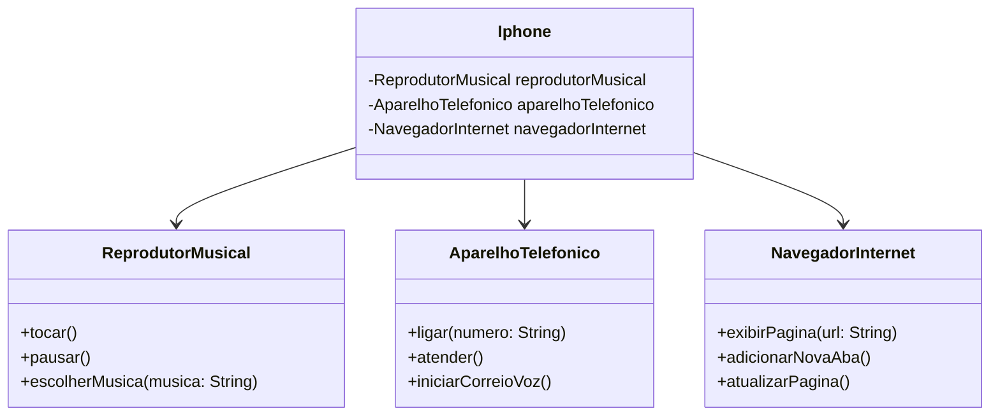

<<<<<<< HEAD
## Getting Started

Welcome to the VS Code Java world. Here is a guideline to help you get started to write Java code in Visual Studio Code.

## Folder Structure

The workspace contains two folders by default, where:

- `src`: the folder to maintain sources
- `lib`: the folder to maintain dependencies

Meanwhile, the compiled output files will be generated in the `bin` folder by default.

> If you want to customize the folder structure, open `.vscode/settings.json` and update the related settings there.

## Dependency Management

The `JAVA PROJECTS` view allows you to manage your dependencies. More details can be found [here](https://github.com/microsoft/vscode-java-dependency#manage-dependencies).
=======
# Desafio-Java-Iphone-Dio
Olá! meu nome é Anderson e esse projeto foi criado no curso de Java no módulo sobre orientação a objetos da plataforma DIO.

Este desafio teve como objetivo modelar e diagramar a representação UML do componente iPhone, abrangendo suas funcionalidades como Reprodutor Musical, Aparelho Telefônico e Navegador na Internet.

Além do diagrama, o código em Java do componente foi elaborado e encontra-se neste repositório.

O diagrama UML do componente Iphone:

>>>>>>> 630af01131e121aa58ee31c41cc6284e7c8bffe8
