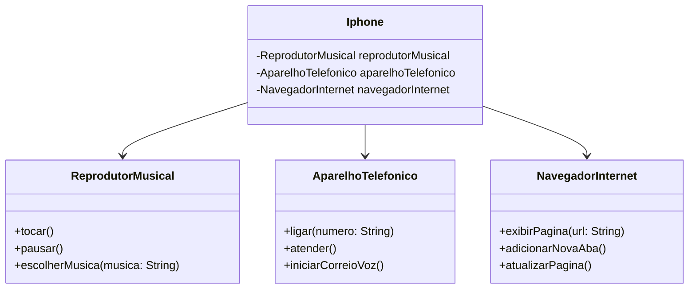

# Desafio-Java-Iphone-Dio
Olá! meu nome é Anderson e esse projeto foi criado no curso de Java no módulo sobre orientação a objetos da plataforma DIO.

Este desafio teve como objetivo modelar e diagramar a representação UML do componente iPhone, abrangendo suas funcionalidades como Reprodutor Musical, Aparelho Telefônico e Navegador na Internet.

Além do diagrama, o código em Java do componente foi elaborado e encontra-se neste repositório.

O diagrama UML do componente Iphone:

